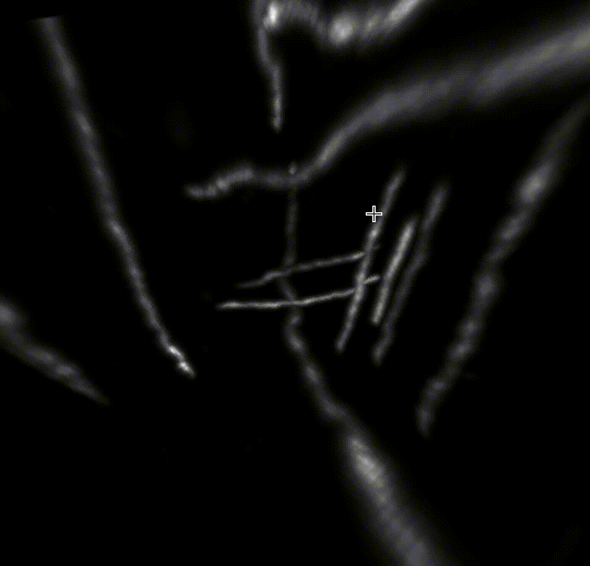

# Skeleton-Annotator
Simple tool to annotator skeleton of 3D curvilinear structure


## Dependencies
latest version of:
brightest_path_lib \
magicgui \
napari \
numpy \
tifffile

## Usage
```
python annotator.py
```
Click Select file button to load an 3D tiff image, then press refresh to update canvas. An example data imaged by [VISoR](https://www.nature.com/articles/s41587-021-00986-5) is at ./assets/img_20.tif

Use left and right double click to add start point and goal point. Then push f key to find a path between the two points.



## Future plan
This will be packaged as a napari plugin later.
